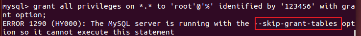

# 1.vmware搭建3个虚拟机群
node01
node01
node01

## 1.1配置mac地址
使用vmware适配器生成

## 1.2配置ipv4
1. 网关 192.168.181.2
2. 三台机器处于同一网段

## 1.3更改hostname
ubuntu系统文件位置 /etc/hostname 

## 1.4host与域名映射
* ubuntu系统文件位置 /etc/hosts 
	* 192.168.181.100 node01 node01.hadoop.com
	* 192.168.181.110 node02 node02.hadoop.com
	* 192.168.181.120 node03 node03.hadoop.com

## 1.5 关闭防火墙和selinux内核
1.5.1 防火墙在生产环境不关闭，学习阶段关闭

**关闭防火墙**

`sudo ufw disable` 关闭防火墙

1.5.2 selinux时Linux的内核，可针对进程进行权限管理，linux是针对于文件。如果开启selinux将需要做非常复杂的配置，学习阶段，非生产环境一般不使用。

**关闭selinx**

输入以下命令打开`/etc/selinux/config`配置文件。

`sudo gedit /etc/selinux/config`

修改/etc/selinux/config文件中设置为：`SELINUX=disabled`

## 1.6 ssh免密登录
ubuntu默认不安装ssh服务，`sudo apt-get install openssh-server`

**ssh** secure shell 可以为一些通信协议进行安全加密，如telnet
原理:公钥私钥配对，分发出自己的私钥，对方发送随机信息后，自己用私钥解密并发回验证。

每一台机器
第一步：本地客户端生成公私钥：
`ssh-keygen -t rsa` 生成公私钥对(id_rsa, id_rsa.pub)

第二步：把每台机器的公钥复制到node01机器的/ssh/authorized_keys文件中

`ssh-copy-id node01` 拷贝公钥

注意：每台机器自身的公钥也要复制到自己的authorized_keys文件中，使得客户端通过ssh访问客户端本身，在hadoop启动时，启动脚本所在的机器会有这个操作。

第三步 : 其他机器node02 node03也需要node01的authorized_keys文件夹
scp是secure copy的简写，用于在Linux下进行远程拷贝文件的命令,不能跨服务器
`scp /home/hr/.ssh/authorized_keys node02:/home/hr/.ssh`
`scp /home/hr/.ssh/authorized_keys node03:/home/hr/.ssh`
将node01下的author...文件夹拷贝到node02、03

验证登录

## 1.6 机器时间同步
分布式系统，例如对存储一个数据,各个节点记录的时间不同就会出现问题

* 一、 所有主机和同一台主机时间保持同步
* 二、 联网与时间同步服务器保持一致
	* NTP服务器【Network Time Protocol（NTP）】是用来使计算机时间同步化的一种协议，它可以使计算机对其服务器或时钟源（如石英钟，GPS等等)做同步化
	* 安装ntp `sudo apt-get install ntp`
	* 创建anonymous的crontab定时服务文件 `crontab -e` 加入`*/1 * * * * /usr/sbin/ntpdate ntp4.aliyun.com;`与aliyun服务器时钟保持一致，一分钟验证一次

## 1.7 安装jdk
mkdir -p export/softwares
mkdir -p export/servers

jdk解压缩放在servers中

在etc/profile里加入
export JAVA_HOME=/home/hr/export/servers/jdk1.8.0_141
export PATH=:$JAVA_HOME/bin:$PATH

$ source /etc/profile 生效profile文件
$ java -version
java version "1.8.0_141"

## 1.8 在线安装mysql

ubuntu 14 
mysql 5.5
link:https://www.likecs.com/show-204245127.html

**确保你的仓库已经被更新：**

`sudo apt update`

**安装**

`sudo apt-get install mysql-server`          //服务端

`sudo apt-get install mysql-client `         //客户端

`sudo apt-get install libmysqlclient-dev`    //程序编译时链接的库

**打开mysql用户的远程登陆**

* 1.修改配置文件是其它ip可以连接到此mysql服务
`sudo gedit /etc/mysql/my.cnf` 不同数据库文件位置文件名不同
* 2.在[mysqld]后面任意一行添加“skip-grant-tables”（注：skip-grant-tables：不启动grant-tables授权表。它的作用是MYSQL服务器不加载权限判断，mysql中的任何用户都可以访问数据库）。
* 3.将 bind-address   = 127.0.0.1  修改为 bind-address     = 0.0.0.0（注：这是将访问数据库的主机ip设置为任意ip的意思）
* 
* 
* 4.重启mysql 
命令：`service mysql restart` （mysql5.5的重启命令 ，如果您是mysql5.7或以上版本请用service mysqld restart）
* 

**连接数据库**

`mysql -u root -p`  -u 表示选择登陆的用户名， -p 表示登陆的用户密码，上面命令输入之后会提示输入密码，此时输入密码就可以登录到mysql。

**开放数据库中任何一个数据库的任何表权限给所有以root登录的机器
`grant all privileges on *.* to 'root'@'%' identified by '123456' with grant option;`
`flush privileges`
这句话与 skip-grant-tables 相同

*.*: 任何数据库下的任何表 crm.usertable
'root'@'%' : root@192.168.1.100

**服务管理**
启动 `sudo service mysql start`
停止 `sudo service mysql stop`
查看服务状态 `sudo service mysql status`

## 1.9 shell脚本基础
格式
以`#!/bin/bash`开头

执行
1. `sh hello.sh`
2. `chmod +x ./hello.sh`赋予文件可执行权限 
   `./hello.sh` 执行文件

**变量**

* 局部变量
str = "hello"
echo ${str}world //helloworld
echo $str // hello

* 环境变量:系统已经定义好的变量

`env` 查看所有环境变量

`echo $PATH` 查看PATH环境变量

在/etc/profile中可以自己定义环境变量

**特色字符**
执行脚本时，可以在命令后加上参数，使用如下特殊符号可以查看参数信息

**运算符**

echo `expr $a /* $b`; *需要转义

**语句**

* if
 

    	if [ ]
			then
			elif [ ]
			then
			else
		fi

* for

		for N in 1 2 3
		do
			echo xxx
		done 

		for ((i = 0; i <=5 ; i++))
		do
			echo xxx
		done 

* 函数

	function(){}
	
	调用 
			
		function
		echo $? //返回上一次程序执行的结果