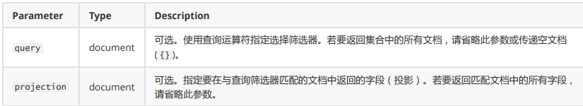
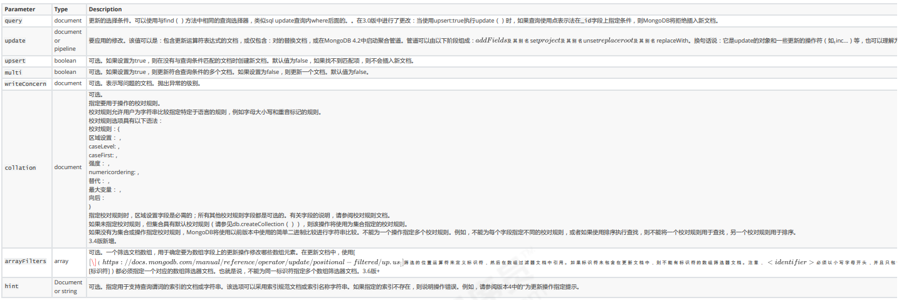

# 3.1 案例需求 #
存放文章评论的数据存放到MongoDB中，数据结构参考如下：

数据库：articledb

# 3.2 数据库操作 #
## 3.2.1 选择和创建数据库 ##

选择和创建数据库的语法格式：
	
	use databasexxx
如果数据库不存在则自动创建

**注意：**

数据库名可以是满足以下条件的任意UTF-8字符串。

- 不能是空字符串（"")。
- 不得含有' '（空格)、.、$、/、\和\0 (空字符)。
- 应全部小写。
- 最多64字节。

创建的新的数据库首先放在内存里，也就是使用`show dbs`不会显示出来，只有写入数据后，才会将数据库写入磁盘中,也就是持久化到磁盘

**特殊数据库**

* **admin：**从权限的角度来看，这是"root"数据库。要是将一个**用户添加到这个数据库**，这个用户自动继承所有数据库的权限。一些特定的服务器端命令也只能从这个数据库运行，比如列出所有的数据库或者关闭服务器。
* **local:** 这个数据永远不会被复制，可以用来存储限于本地单台服务器的任意集合
* **config:** 当Mongo用于**分片设置**时，config数据库在内部使用，用于保存分片的相关信息。

3.2.2 数据库的删除

MongoDB 删除数据库的语法格式如下：
	
	db.dropDatabase()

# 3.3 集合操作 #
集合，类似关系型数据库中的表。
可以显示的创建，也可以隐式的创建。
## 3.3.1 集合的显式创建（了解） ##
	db.createCollection(name)
name:collection name

## 3.3.2 集合的隐式创建 ##
当向一个集合中插入一个文档的时候，如果集合不存在，则会自动创建集合。
详见 文档的插入 章节。
提示：通常我们使用隐式创建文档即可。
## 3.3.3 集合的删除 ##
集合删除语法格式如下：
	
	db.collection.drop()
	或
	db.集合.drop()

#  3.4 文档基本CRUD #
文档（document）的数据结构和 JSON 基本一样。
所有存储在集合中的数据都是 BSON 格式。
## 3.4.1 文档的插入 ##
（1）**单个文档插入**
使用insert() 或 save() 方法向集合中插入文档，语法如下：

	db.collection.insert(
	<document or array of documents>,
	{
	writeConcern: <document>,
	ordered: <boolean>
	}
	)

【示例】
要向comment的集合(表)中插入一条测试数据：

	db.comment.insert({"articleid":"100000","content":"今天天气真好，阳光明
	媚","userid":"1001","nickname":"Rose","createdatetime":new Date(),"likenum":NumberInt(10),"state":null})

提示：
 
1. comment集合如果不存在，则会隐式创建
1. mongo中的数字，默认情况下是double类型，如果要存整型，必须使用函数NumberInt(整型数字)，否则取出来就有问题了。
1. 插入当前日期使用 new Date()
1. 插入的数据没有指定 _id ，会自动生成主键值
1. 如果某字段没值，可以赋值为null，或不写该字段。

注意：

1. 文档中的键/值对是有序的。
1. 文档中的值不仅可以是在双引号里面的字符串，还可以是其他几种数据类型（甚至可以是整个嵌入的文档)。
1. MongoDB区分类型和大小写。
1. MongoDB的文档不能有重复的键。
1. 文档的键是字符串。除了少数例外情况，键可以使用任意UTF-8字符。
2. 
文档键命名规范：
1. 键不能含有\0 (空字符)。这个字符用来表示键的结尾。
1. .和$有特别的意义，只有在特定环境下才能使用。
1. 以下划线"_"开头的键是保留的(不是严格要求的)。
 

（2）**批量插入**

语法：
	db.collection.insertMany(
	[ <document 1> , <document 2>, ... ],
	{
	writeConcern: <document>,
	ordered: <boolean>
	}
	)

【示例】
批量插入多条文章评论：

	db.comment.insertMany([
	{"_id":"1","articleid":"100001","content":"我们不应该把清晨浪费在手机上，健康很重要，一杯温水幸福你我
	他。","userid":"1002","nickname":"相忘于江湖","createdatetime":new Date("2019-08-
	05T22:08:15.522Z"),"likenum":NumberInt(1000),"state":"1"},
	{"_id":"2","articleid":"100001","content":"我夏天空腹喝凉开水，冬天喝温开水","userid":"1005","nickname":"伊人憔
	悴","createdatetime":new Date("2019-08-05T23:58:51.485Z"),"likenum":NumberInt(888),"state":"1"},
	{"_id":"3","articleid":"100001","content":"我一直喝凉开水，冬天夏天都喝。","userid":"1004","nickname":"杰克船
	长","createdatetime":new Date("2019-08-06T01:05:06.321Z"),"likenum":NumberInt(666),"state":"1"},
	{"_id":"4","articleid":"100001","content":"专家说不能空腹吃饭，影响健康。","userid":"1003","nickname":"凯
	撒","createdatetime":new Date("2019-08-06T08:18:35.288Z"),"likenum":NumberInt(2000),"state":"1"},
	{"_id":"5","articleid":"100001","content":"研究表明，刚烧开的水千万不能喝，因为烫
	嘴。","userid":"1003","nickname":"凯撒","createdatetime":new Date("2019-08-
	06T11:01:02.521Z"),"likenum":NumberInt(3000),"state":"1"}
	]);

提示：

* 插入时指定了 _id ，则主键就是该值。
* 如果某条数据插入失败，将会终止插入，但**已经插入成功的数据不会回滚掉**。
因为批量插入由于数据较多容易出现失败，因此，可以使用try catch进行异常捕捉处理，测试的时候可以不处理。如（了解）：

		try {
		db.comment.insertMany([
		{"_id":"1","articleid":"100001","content":"我们不应该把清晨浪费在手机上，健康很重要，一杯温水幸福你我
		他。","userid":"1002","nickname":"相忘于江湖","createdatetime":new Date("2019-08-
		05T22:08:15.522Z"),"likenum":NumberInt(1000),"state":"1"},
		{"_id":"2","articleid":"100001","content":"我夏天空腹喝凉开水，冬天喝温开水","userid":"1005","nickname":"伊人憔
		悴","createdatetime":new Date("2019-08-05T23:58:51.485Z"),"likenum":NumberInt(888),"state":"1"},
		{"_id":"3","articleid":"100001","content":"我一直喝凉开水，冬天夏天都喝。","userid":"1004","nickname":"杰克船
		长","createdatetime":new Date("2019-08-06T01:05:06.321Z"),"likenum":NumberInt(666),"state":"1"},
		{"_id":"4","articleid":"100001","content":"专家说不能空腹吃饭，影响健康。","userid":"1003","nickname":"凯
		撒","createdatetime":new Date("2019-08-06T08:18:35.288Z"),"likenum":NumberInt(2000),"state":"1"},
		{"_id":"5","articleid":"100001","content":"研究表明，刚烧开的水千万不能喝，因为烫
		嘴。","userid":"1003","nickname":"凯撒","createdatetime":new Date("2019-08-
		06T11:01:02.521Z"),"likenum":NumberInt(3000),"state":"1"}
		]);
		} catch (e) {
		print (e);
		}

## 3.4.2 文档的基本查询 ##
查询数据的语法格式如下：

	db.collection.find(<query>, [projection])

【示例】
**（1）查询所有**
如果我们要查询spit集合的所有文档，我们输入以下命令

	db.comment.find()
	或
	db.comment.find({})

如果我想按一定条件来查询，比如我想查询userid为1003的记录，怎么办？很简单！只 要在find()中添加参数即可，参数也是json格式，如下：

	db.comment.find({userid:'1003'})

 	将返回所有userid为1003的记录

如：查询用户编号是1003的记录，但只最多返回符合条件的第**一条记录**：
	
	db.comment.findOne({userid:'1003'})

**（2）投影查询（Projection Query）：**
如果要查询结果**返回部分字段**，则需要使用投影查询（不显示所有字段，只显示指定的字段）。
如：查询结果只显示 _id、userid、nickname :

	>db.comment.find({userid:"1003"},{userid:1,nickname:1})
	{ "_id" : "4", "userid" : "1003", "nickname" : "凯撒" }
	{ "_id" : "5", "userid" : "1003", "nickname" : "凯撒" }
	默认 _id 会显示。

如：查询结果只显示 、userid、nickname ，不显示 _id ：

	>db.comment.find({userid:"1003"},{userid:1,nickname:1,_id:0})
	{ "userid" : "1003", "nickname" : "凯撒" }
	{ "userid" : "1003", "nickname" : "凯撒" }

再例如：查询所有数据，但只显示 _id、userid、nickname :

	>db.comment.find({},{userid:1,nickname:1})

## 3.4.3 文档的更新 ##
更新文档的语法：

	db.collection.update(query, update, options)
	//或
	db.collection.update(
	<query>,
	<update>,
	{
	upsert: <boolean>,
	multi: <boolean>,
	writeConcern: <document>,
	collation: <document>,
	arrayFilters: [ <filterdocument1>, ... ],
	hint: <document|string> // Available starting in MongoDB 4.2
	}
	)

【示例】

（1）覆盖的修改
如果我们想修改_id为1的记录，点赞量为1001，输入以下语句：
	
	db.comment.update({_id:"1"},{likenum:NumberInt(1001)})
	第一个参数查询条件，第二个替换的记录

执行后，我们会发现，这条文档除了likenum字段其它字段都不见了

（2）局部修改

为了解决这个问题，我们需要使用修改器$set来实现，命令如下：

我们想修改_id为2的记录，浏览量为889，输入以下语句：

	db.comment.update({_id:"2"},{$set:{likenum:NumberInt(889)}})

（3）批量的修改 multi选项为true

更新所有用户为 1003 的用户的昵称为 凯撒大帝 

	//默认只修改第一条数据
	db.comment.update({userid:"1003"},{$set:{nickname:"凯撒2"}})
	//修改所有符合条件的数据
	db.comment.update({userid:"1003"},{$set:{nickname:"凯撒大帝"}},{multi:true})

（3）列值增长的修改

如果我们想实现对某列值在原有值的基础上进行增加或减少，可以使用 $inc 运算符来实现

需求：对3号数据的点赞数，每次递增1

	db.comment.update({_id:"3"},{$inc:{likenum:NumberInt(1)}})

## 3.4.4 删除文档 ##
删除文档的语法结构：
	
	db.集合名称.remove(条件)

以下语句可以将数据全部删除，请慎用

	db.comment.remove({})
如果删除_id=1的记录，输入以下语句

	db.comment.remove({_id:"1"})

# 3.5 文档的分页查询 #
## 3.5.1 统计查询 ##
统计查询使用count()方法，语法如下：

	db.collection.count(query, options)

【示例】
（1）统计所有记录数：
统计comment集合的所有的记录数：

	db.comment.count()

（2）按条件统计记录数：

	db.comment.count({userid:"1003"})
例如：统计userid为1003的记录条数
提示：
默认情况下 count() 方法返回符合条件的全部记录条数。

## 3.5.2 分页列表查询 ##
可以使用limit()方法来读取指定数量的数据，使用skip()方法来跳过指定数量的数据。
基本语法如下所示：

	>db.COLLECTION_NAME.find().limit(NUMBER).skip(NUMBER)

