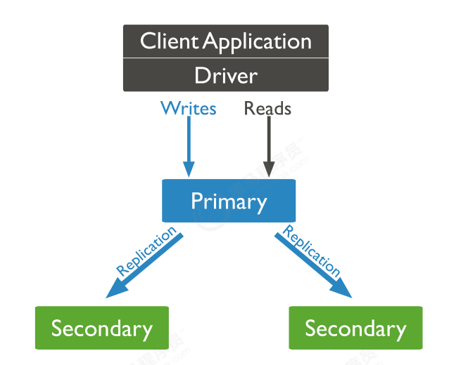
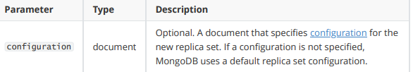
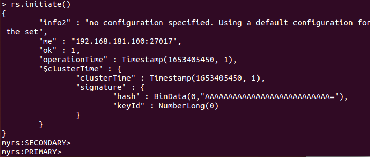
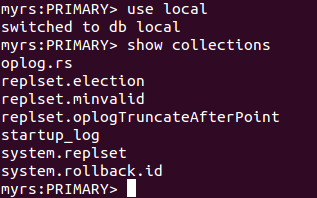
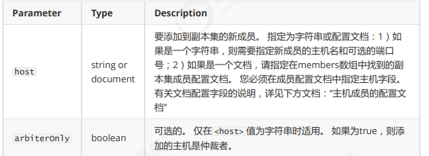

# MongoDB集群和安全 #

# 1. 副本集-Replica Sets #
## 1.1 简介 ##

MongoDB中的副本集（Replica Set）是一组维护相同数据集的mongod服务。 副本集可提供冗余和高可用性，是所有生产部署的基础。

也可以说，副本集类似于有自动故障恢复功能的主从集群。通俗的讲就是用多台机器进行同一数据的异步同步，从而使多台机器拥有同一数据的多个副本，并且当主库当掉时在不需要用户干预的情况下自动切换其他备份服务器做主库。而且还可以利用副本服务器做只读服务器，实现读写分离，提高负载

1.冗余和数据可用性

复制提供冗余并提高数据可用性。 通过在不同数据库服务器上提供多个数据副本，复制可提供一定级别的容错功能，以防止丢失单个数据库服务器。
在某些情况下，复制可以提供增加的读取性能，因为客户端可以将读取操作发送到不同的服务上， 在不同数据中心维护数据副本可以增加分布式应用程序的数据位置和可用性。 您还可以为专用目的维护其他副本，例如灾难恢复，报告或备份。

2.MongoDB中的复制

副本集是一组维护相同数据集的mongod实例。 副本集包含多个数据承载节点和可选的一个仲裁节点。

在承载数据的节点中，一个且仅一个成员被视为主节点，而其他节点被视为次要（从）节点。
主节点接收所有写操作。 副本集只能有一个主要能够确认具有{w：“most”}写入关注的写入; 虽然在某些情况下，另一个mongod实例可能暂时认为自己也是主要的。主要记录其操作日志中的数据集的所有更改，即oplog

辅助(副本)节点复制主节点的oplog并将操作应用于其数据集，以使辅助节点的数据集反映主节点的数据集。 如果主要人员不在，则符合条件的中学将举行选举以选出新的主要人员。

3.主从复制和副本集区别

主从集群和副本集最大的区别就是副本集没有固定的“主节点”；整个集群会选出一个“主节点”，当其挂掉后，又在剩下的从节点中选中其他节点为“主节点”，副本集总有一个活跃点(主、primary)和一个或多个备份节点(从、secondary)。

## 1.2 副本集的三个角色 ##

三种角色：

**主要成员（Primary）**：主要接收所有写操作。就是主节点。

**副本成员（Replicate）**：从主节点通过复制操作以维护相同的数据集，即备份数据，不可写操作，但可以读操作（但需要配置）。是默认的一种从节点类型。

**仲裁者（Arbiter）**：不保留任何数据的副本，只具有投票选举作用。当然也可以将仲裁服务器维护为副
本集的一部分，即副本成员同时也可以是仲裁者。也是一种从节点类型。

##  1.4 副本集的创建  ##
### 1.4.1 第一步：创建主节点 ###

**建立存放数据和日志的目录**

	#-----------myrs
	#主节点
	mkdir -p /mongodb/replica_sets/myrs_27017/log \ &
	mkdir -p /mongodb/replica_sets/myrs_27017/data/db

新建或修改配置文件：

	systemLog:
	#MongoDB发送所有日志输出的目标指定为文件
	destination: file
	#mongod或mongos应向其发送所有诊断日志记录信息的日志文件的路径
	path: "/mongodb/replica_sets/myrs_27017/log/mongod.log"
	#当mongos或mongod实例重新启动时，mongos或mongod会将新条目附加到现有日志文件的末尾。
	logAppend: true
	storage:
	#mongod实例存储其数据的目录。storage.dbPath设置仅适用于mongod。
	dbPath: "/mongodb/replica_sets/myrs_27017/data/db"
	journal:
	启动节点服务：
	1.4.2 第二步：创建副本节点
	建立存放数据和日志的目录
	新建或修改配置文件：
	myrs_27018：
	#启用或禁用持久性日志以确保数据文件保持有效和可恢复。
	enabled: true
	processManagement:
	#启用在后台运行mongos或mongod进程的守护进程模式。
	fork: true
	#指定用于保存mongos或mongod进程的进程ID的文件位置，其中mongos或mongod将写入其PID
	pidFilePath: "/mongodb/replica_sets/myrs_27017/log/mongod.pid"
	net:
	#服务实例绑定所有IP，有副作用，副本集初始化的时候，节点名字会自动设置为本地域名，而不是ip
	#bindIpAll: true
	#服务实例绑定的IP
	bindIp: localhost,192.168.0.2
	#bindIp
	#绑定的端口
	port: 27017
	replication:
	#副本集的名称
	replSetName: myrs

创建副本节点与仲裁节点。过程相同，除了需要修改配置文件中ip

### 1.4.2 初始化配置副本集和主节点 ###

连接任意一个节点，但这里尽量要连接主节点：

	mongo --host=192.168.181.100 --port=27017
	or
	mongo 192.168.181.100：27017

结果，连接上之后，很多命令无法使用，，比如 show dbs 等，必须初始化副本集才行
准备初始化新的副本集：
语法：

	rs.initiate(configuration)

**示例**

	> use admin
	> cfg = {_id: "ynzw",members:[{_id: 0,host: '10.211.55.10:27017',priority: 3},{_id: 1,host: '10.211.55.10:27018',priority: 2},{_id: 2,host: '10.211.55.10:27019',priority: 1},{_id: 3,host: '10.211.55.10:27020',arbiterOnly: true}]};
	> rs.initiate(cfg)    #使配置生效

configuration可以为空，即为默认配置
> rs.initiate()

结果

1）“ok”的值为1，说明创建成功。
2）命令行提示符发生变化，变成了一个从节点角色，此时默认不能读写。稍等片刻，回车，变成主节
点。

再运行> rs.conf()可查看默认配置

.png)

副本集配置的查看命令本质是查询`system.replset`表中的数据

rs.status()查看节点状态

### 1.4.3 添加副本从节点 ###
在主节点添加从节点，将其他成员加入到副本集

语法：

	rs.add(host, arbiterOnly)

