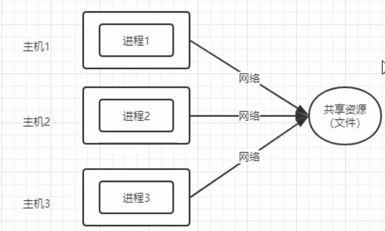
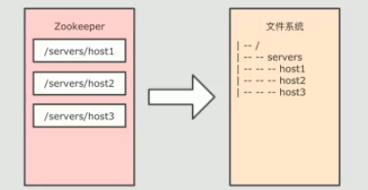
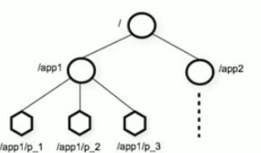
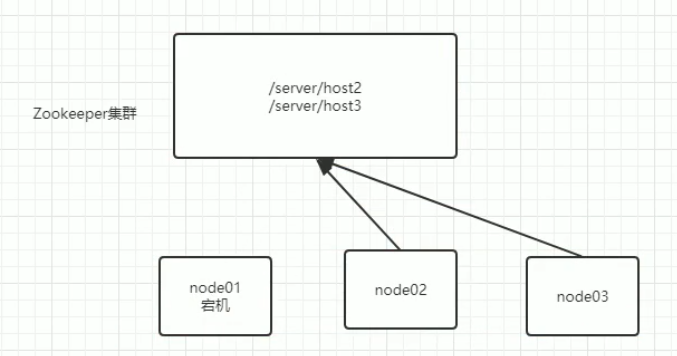
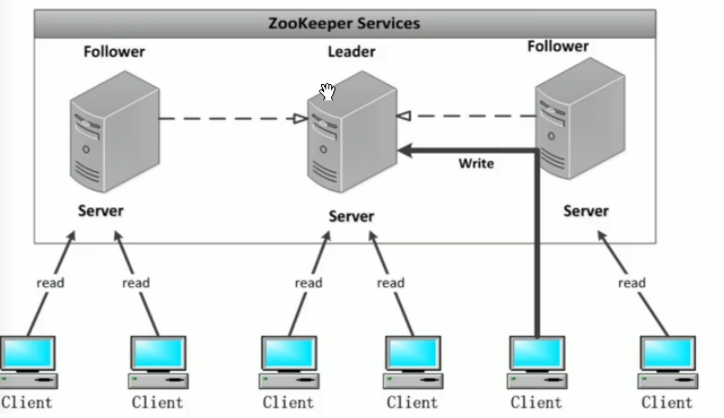
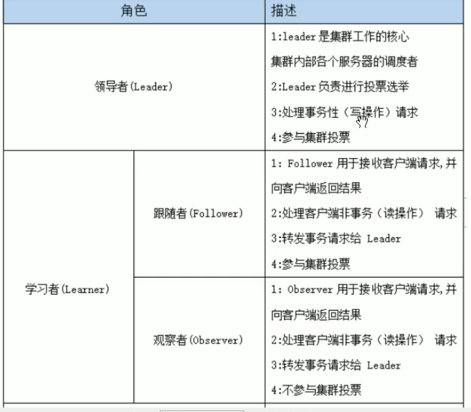

#zookeeper

ZooKeeper是一个分布式的，开放源码的分布式应用程序协调服务，是Google的Chubby一个开源的实现，是Hadoop和Hbase的重要组件。它是一个为分布式应用提供一致性服务的软件，提供的功能包括：配置维护、域名服务、分布式同步、组服务等。主要用来解决分布式集群中应用系统的一致性问题和数据管理问题

为什么需要zookeeper: 在分布式系统中，主机间访问同一资源使用网络，1.如何去确保多个主机访问同一共享资源的一致性问题。引出概念分布式锁 2.如何确保多个共享资源之间的一致性

# 1.数据模型
Zookeeper本质上是一个分布式文件系统，适合存放小文件，也可以理解为一个数据库

将一个zookeeper集群抽象为一个树状结构，每一个节点称为一个Znode，Znode具有文件和文件夹的特点

树形层次结构

* zookeeper 树中的每个节点被称为一个**Znode**
* Znode兼具**文件**和**目录**两种特点。既像文件一样维护着数据、元信息等数据结构，又像目录一样可以作为路径标识的一部分，并具有子Znode，用户可对Znode做增删改查等操作。
* Znode存储数据大小有限制
* Znode通过**绝对路径引用**
* Znode由**3部分组成**
	*  stat：描述Znode的版本，权限等
	*  data
	*  children 子节点

## 1.1 Znode节点类型
* 临时节点：改节点的生命周期**依赖于创建它的会话session**(客户端连接到服务器过程)，会话结束临时节点自动删除。**临时节点不允许有子节点**。**意义:**可用于监控某个主机是否存活，创建一个临时节点，某一天如果所连接的主机宕机，所创建临时节点随之消失 
* 永久节点：不依赖于会话，只有在客户端删除时才会消失

## 1.2 特性：序列化
如果创建时指定，改节点后会自动追加一个不断增加的序列号，该序列号对于父节点时唯一的，这样便于记录每个子节点的先后顺序。 格式 %10d 即10位数字如0000000001

* persistent:永久节点
* ephemeral：临时节点
* persistent_sequantial
* ephemeral_sequantial

# 2.Zookeeper的应用场景

## 2.1 数据发布/订阅

[数据发布/订阅系统](),需要发布者将数据发布到Zookeeper的节点上，供订阅者进行数据订阅，进而达到动态获取数据的目的，实现配置信息的集中式管理和数据的动态更新。

​发布/订阅一般有两种设计模式：推模式和拉模式，服务端主动将数据更新发送给所有订阅的客户端称为推模式；客户端主动请求获取最新数据称为拉模式.

**Zookeeper采用了推拉相结合的模式**，客户端向服务端注册自己需要关注的节点，一旦该节点数据发生变更，那么服务端就会向相应的客户端推送Watcher事件通知（watch机制监控节点变化），客户端接收到此通知后，主动到服务端获取最新的数据。

## 2.2 命名服务

命名服务是分步实现系统中较为常见的一类场景，分布式系统中，被命名的实体通常可以是集群中的机器、提供的服务地址或远程对象等，通过命名服务，**客户端可以根据指定名字（唯一路径名）来获取资源的实体**，在分布式环境中，上层应用仅仅需要一个全局唯一的名字。**Zookeeper可以实现一套分布式全局唯一ID(序列号)的分配机制。**

## 2.3 分布式协调/通知

Zookeeper中特有的Watcher注册于异步通知机制，能够很好地实现分布式环境下不同机器，甚至不同系统之间的协调与通知，从而实现对数据变更的实时处理。通常的做法是**不同的客户端都对Zookeeper上的同一个数据节点进行Watcher注册**，监听数据节点的变化（包括节点本身和子节点），若数据节点发生变化，那么所有订阅的客户端都能够接收到相应的Watcher通知，并作出相应处理。

在绝大多数分布式系统中，系统机器间的通信无外乎[**心跳检测**、**工作进度汇报**和**系统调度**]()。

① **心跳检测，不同机器间**需要检测到彼此是否在正常运行，可以使用Zookeeper实现机器间的心跳检测，基于其临时节点特性（临时节点的生存周期是客户端会话，客户端若当即后，其临时节点自然不再存在），**可以让不同机器都在Zookeeper的一个指定节点下创建临时子节点**，不同的机器之间可以根据这个临时子节点(消亡)来判断对应的客户端机器是否存活。通过Zookeeper可以大大减少系统耦合。

② **工作进度汇报**，通常任务被分发到不同机器后，需要实时地将自己的任务执行进度汇报给分发系统，可以在Zookeeper上选择一个节点，每个任务客户端都在这个节点下面创建临时子节点，这样不仅可以判断机器是否存活，同时各个机器可以将自己的任务执行进度写到该临时节点中去，以便中心系统能够实时获取任务的执行进度。

③ **系统调度**，Zookeeper能够实现如下系统调度模式：分布式系统由控制台和一些客户端系统两部分构成，控制台的职责就是需要将一些指令信息发送给所有的客户端，以控制他们进行相应的业务逻辑，后台管理人员在控制台上做一些操作，实际上就是修改Zookeeper上某些节点的数据，Zookeeper可以把数据变更以时间通知的形式发送给订阅客户端。

## 2.4分布式锁

分布式锁用于控制分布式系统之间同步访问共享资源的一种方式，可以保证不同系统访问一个或一组资源时的一致性，主要分为**排它锁**和**共享锁**。

* **排它锁又称为写锁**：某个事物给某个数据对象加上排它锁，那么在整个加锁期间，只允许改事物对数据对象进行操作，任何其他对象不能对其进行操作，直到该事务释放锁

 * **获取锁**：所有客户端通过调用接口，在zookeeper根目录下的/exclusive_lock节点下创建临时子节点/exclusive_lock/lock。Zookeeper可以保证只有一个客户端能够创建成功，没有成功的客户端需要注册/exclusive_lock节点监听。
 * **释放锁**:当获取锁的客户端宕机或者正常完成业务逻辑都会导致临时节点的删除，此时，所有在/exclusive_lock节点上注册监听的客户端都会收到通知，可以重新发起分布式锁获取。

* **共享锁**又称为读锁，若事务T1对数据对象O1加上共享锁，那么当前事务只能对O1进行**读**取操作，**其他事务也只能对这个数据对象加共享锁**，直到该数据对象上的所有共享锁都被释放。在需要获取共享锁时，所有客户端都会到/shared_lock下面创建一个**临时顺序节点**

## 2.5 分布式队列

有一些时候，多个团队需要共同完成一个任务，比如，A团队将Hadoop集群计算的结果交给B团队继续计算，B完成了自己任务再交给C团队继续做。分布式系统场景

分布式环境下，我们同样需要一个类似单进程队列的组件，用来实现跨进程、跨主机、跨网络的数据共享和数据传递，这就是我们的分布式队列。 

# 3.Zookeeper架构
Zookeeper集群是一个基于主从架构的高可用(该集群可以24h工作)集群

每个服务器承担三种角色中的一种：

* Leader 一个zookeeper集群同一时间只会有一个实际工作的Leader，所有的写操作必须通过Leader将写操作广播给其他服务器。
* Follow 一个Zookeeper集群可能同时存在多个Follower，它会响应Leader心跳
Follow可直接响应客户端的读请求，将写请求转发给Leader处理，并负责在Leader处理写请求时对请求进行投票。
* Observer 于follow类似，但无权投票

## 3.1 Zookeeper的选举机制
Leader选举是保证分布式**数据一致性**的关键所在。当Zookeeper集群中的一台服务器出现以下两种情况之一时，需要进入Leader选举。至少有两台可互相通信的机器，才会选举
### 3.1.1. 服务器启动时期的Leader选举
**1.每个Server发出一个投票。**由于是初始情况，Server1和Server2都会将自己作为Leader服务器来进行投票，**每次投票会包含所推举的服务器的myid和ZXID**，使用(myid, ZXID)来表示，此时Server1的投票为(1, 0)，Server2的投票为(2, 0)，然后各自将这个投票发给集群中其他机器。
myid：服务器的编号 机器权值，越大越好
zxid：事物id 越大表示事物越新

**2.接受来自各个服务器的投票**。集群的每个服务器收到投票后，首先判断该投票的有效性，如检查是否是本轮投票、是否来自LOOKING状态的服务器。

**3.处理投票**。针对每一个投票，服务器都需要将别人的投票和自己的投票进行PK，PK规则如下

* 优先检查ZXID。ZXID比较大的服务器优先作为Leader。

* 如果ZXID相同，那么就比较myid。myid较大的服务器作为Leader服务器。

对于Server1而言，它的投票是(1, 0)，接收Server2的投票为(2, 0)，首先会比较两者的ZXID，均为0，再比较myid，此时Server2的myid最大，于是更新自己的投票(1,0)改为(2, 0)，然后重新投票，对于Server2而言，其无须更新自己的投票，只是再次向集群中所有机器发出上一次投票信息即可。

**4.统计投票**。每次投票后，服务器都会统计投票信息，判断是否已经有过半机器接受到相同的投票信息，对于Server1、Server2而言，都统计出集群中已经有两台机器接受了(2, 0)的投票信息，此时便认为已经选出了Leader。当第三台机器连入集群网络时，默认已经选出Leader了

**5.改变服务器状态。**一旦确定了Leader，每个服务器就会更新自己的状态，如果是Follower，那么就变更为FOLLOWING，如果是Leader，就变更为LEADING。

### 3.1.2. 服务器启动时期的Leader选举
集群中的Leader主机宕机时，需要重新选Leader

# 4. Zookeeper安装
site:`archive.apache.org/dist` ctrl+f搜索下载zookeeper。 release3.4.9

**1. 解压zookeeper的压缩包到/export/servers路径下去，然后准备进行安装**

**2. 修改配置文件**

第一台机器修改配置文件

	cd /export/servers/zookeeper-3.4.9/conf/
	
	cp zoo_sample.cfg zoo.cfg 拷贝模板
	
	mkdir -p /export/servers/zookeeper-3.4.9/zkdatas/

打开zoo.cfg修改

	dataDir=/home/hr/export/servers/zookeeper-3.4.9/zkdatas
	# 保留多少个快照
	autopurge.snapRetainCount=3
	# 日志多少小时清理一次
	autopurge.purgeInterval=1
	# 集群中服务器地址
	server.1=node01:2888:3888
	server.2=node02:2888:3888
	server.3=node03:2888:3888

**3. 添加myid配置**

3.1 在第一台机器（node01）的

/export/servers/zookeeper-3.4.9/zkdatas /这个路径下创建一个文件，文件名为myid ,文件内容为1

`echo 1 > /export/servers/zookeeper-3.4.9/zkdatas/myid` 

3.2 远程将zookeeper文件夹拷贝给node02，node03. 修改各自机器的myid

`scp -r  /home/hr/export/servers/zookeeper-3.4.9/ node02:/home/hr/export/servers/`

`scp -r  /home/hr/export/servers/zookeeper-3.4.9/ node03:/export/servers/`

**4**：三台机器启动zookeeper服务

这个命令三台机器都要执行

`/export/servers/zookeeper-3.4.9/bin/zkServer.sh start`

查看启动状态

`/export/servers/zookeeper-3.4.9/bin/zkServer.sh  status`
或者 
`jps` 查看java相关进程有 QuorumPeerMain出现

**谁是leader？**

myid信息：
node01:1
node02:2
node03:3

这里我先启动了node01，然后启动了node02，最后启动node03.

node02是leader，因为启动node02后，node1和2已经开始选举，然后node02myid大，node02为leader，此时node03还未加入zookeeper集群中